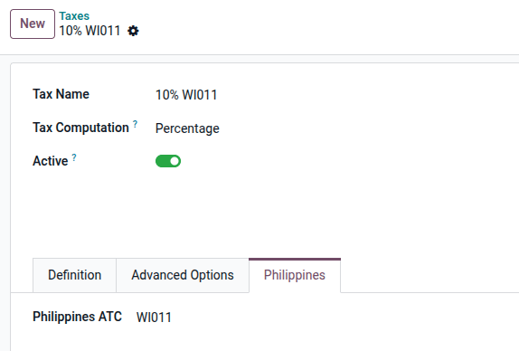
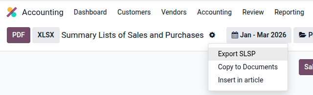
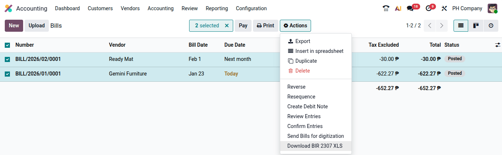
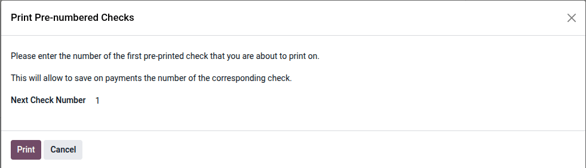

===========
Philippines
===========

.. _philippines/configuration:

Configuration
=============

.. _philippines/modules:

Modules installation
--------------------

:ref:`Install <general/install>` the following modules to get all the features of the Philippines
localization:

.. list-table::
   :header-rows: 1

   * - Name
     - Technical name
     - Description
   * - :guilabel:`Philippines - Accounting`
     - `l10n_ph`
     - This module includes the default
       :ref:`fiscal localization package <fiscal_localizations/packages>`.
   * - :guilabel:`Philippines - Accounting Reports`
     - `l10n_ph_reports`
     - This module includes the accounting reports for Philippines.
   * - :guilabel:`Philippines Checks Layout`
     - `l10n_ph_check_printing`
     - This module includes the features required to enable the PCHC check format.

.. _philippines/company:

Company information
-------------------

To configure your company information, go to the :guilabel:`Contacts` app, search for your company,
and select it. Then configure the following fields:

- :guilabel:`Name`
- :guilabel:`Address`, including the :guilabel:`City`, :guilabel:`State`, :guilabel:`Zip Code`,
  and :guilabel:`Country`.

  - In the :guilabel:`Street` field, enter the street name, number, and any additional address
    information.
  - In the :guilabel:`Street 2` field, enter the barangay.

- :guilabel:`Tax ID`: Taxpayer Identification Number (TIN).
- :guilabel:`RDO`: Revenue District Office code.
- :guilabel:`Phone`
- :guilabel:`Email`

.. note::
   The :guilabel:`Tax ID` should follow the `NNN-NNN-NNN-NNNNN` format. The
   :guilabel:`Company Branch code` corresponds to the last 3 to 5 digits of the entered Tax ID.
   When not provided, it defaults to `000`.

.. _philippines/contacts:

Contacts
========

The Philippine localization utilizes specific fields on contacts to generate
:abbr:`BIR (Bureau of Internal Revenue)` reports and files used for submission.

The :guilabel:`Tax ID` field is used to register the :abbr:`TIN (tax identification number)` for
both companies and individuals. Filling in this field is recommended to ensure the accuracy of :ref:`tax
reports <philippines/reports/slsp>`.

For individuals not associated with a company, use the following additional fields to identify
them:

* **First Name**
* **Middle Name**
* **Last Name**

.. _philippines/taxes:

Taxes
=====

Default taxes are created automatically when the :guilabel:`Philippines - Accounting` (`l10n_ph`)
and :guilabel:`Philippines - Accounting Reports` (`l10n_ph_reports`) modules are :ref:`installed
<general/install>`. These :ref:`taxes <philippines/taxes>` are used to generate the :ref:`tax
reports <philippines/reports>`.

The following categories of :doc:`taxes <../accounting/taxes>` are installed and linked to the
relevant account:

- :guilabel:`Sales and Purchase VAT`: 12%
- :guilabel:`Sales and Purchase VAT Zero-Rated`: 0%
- :guilabel:`Sales and Purchase VAT Exempt`: Exempt
- :guilabel:`Withholding Tax`: Expanded Withholding Tax (EWHT), Final Withholding Tax (FWHT), and
  Withholding VAT (WVAT).

.. tip::
   Default taxes are pre-configured and mapped to the relevant reports. To create a new tax, it is
   recommended to **duplicate** an existing one to preserve this configuration. To do so, select
   the tax, click the :icon:`fa-cog` :guilabel:`(gear)` icon, and click :guilabel:`Duplicate`.

.. _philippines/taxes/atc:

ATC codes
---------

Each tax type includes a :guilabel:`Philippines` tab, where additional fields such as :guilabel:`ATC`
(Alphanumeric Tax Code) are available for withholding taxes.

ATC codes are essential for generating the **BIR 2307**, :guilabel:`SAWT`, and :guilabel:`QAP`
reports. These codes ensure compliance with regulatory requirements.

To configure a withholding tax, go to :menuselection:`Accounting --> Configuration --> Taxes`,
select the tax, and fill in the :guilabel:`Philippines ATC` field under the :guilabel:`Philippines`
tab.

.. _philippines/reports:

Reports
=======

.. _philippines/reports/2550q:

2550Q report
------------

The **BIR Form 2550Q** summarizes sales, purchases, output VAT, input VAT, and the resulting
VAT payable or refundable for the period.

To access it, navigate to :menuselection:`Accounting --> Reporting --> Tax Report`, click the
:guilabel:`Report` button, and select **2550Q (PH)**.

.. _philippines/reports/sawt_qap:

SAWT and QAP reports
--------------------

To access these reports, navigate to :menuselection:`Accounting --> Reporting --> Tax Report`,
click the :guilabel:`Report` button, and select **SAWT & QAP (PH)**.

* **Summary of Alphalist of Withholding Taxes (SAWT)**: Displays all customer invoices that have
  sales withholding taxes applied. This export is used as a supporting document for forms
  **1701Q**, **1701**, **1702Q**, and **1702**.
* **Quarterly Alphalist of Payees (QAP)**: Includes all vendor bills that have purchase
  withholding taxes applied. This export is used as a supporting document for forms **1601EQ** and
  **1604E**.

.. note::
   The generated file is based on the specific **period** selected in the report filter. For example,
   while the **1601EQ** is a quarterly report, `.DAT` files submitted are on a monthly basis.
   Ensure the filter is set to the correct month before exporting.

.. _philippines/reports/sawt_qap/dat:

Export DAT files
~~~~~~~~~~~~~~~~

Both SAWT and QAP reports can be exported in `.DAT` format, compatible with the BIR :abbr:`Alpha
(Alphalist Data Entry and Validation)` module.

#. On the report page, click the :icon:`fa-cog` :guilabel:`(gear)` icon.
#. Click :guilabel:`Export SAWT & QAP`.
#. In the wizard, choose the relevant :guilabel:`Attachment For (e.g., 1601EQ)` and click
   :guilabel:`Export`.

  .. image:: philippines/philippines-sawt-qap-dat.png
    :alt: SAWT QAP .dat export

.. _philippines/reports/slsp:

SLSP reports
------------

The **SLSP (Summary lists of sales and purchases)** is an electronic schedule required from VAT‑registered taxpayers listing sales and
purchase transactions.

To access it, navigate to :menuselection:`Accounting --> Reporting --> Summary Lists of Sales and
Purchases`.

* **Summary List of Sales (SLS)**: Detailed sales per customer with amounts and output VAT.
* **Summary List of Purchases (SLP)**: Detailed purchases per supplier with amounts and input VAT.

.. note::
   - The **Summary List of Purchases** report excludes import by default. To include import
     transactions, use a :guilabel:`Including Importations` filter.

     .. image:: philippines/philippines-slp-import.png
        :alt: SLP Import filter

   - The generated file is based on the specific **period** selected in the report filter. For
     example, while the **2550Q** is a quarterly report, `.DAT` files submitted are on a monthly
     basis. Ensure the filter is set to the correct month before exporting.

.. _philippines/reports/slsp/dat:

Export DAT files
~~~~~~~~~~~~~~~~

SLS and SLP reports can be exported in `.DAT` format, compatible with the :abbr:`BIR ReLiEf
(Reconciliation of Listings for Enforcement)` module.

#. On the report page, click the :icon:`fa-cog` :guilabel:`(gear)` icon.
#. Click :guilabel:`Export SLSP`.
#. In the wizard, choose the relevant :guilabel:`Attachment For` and click :guilabel:`Export`.

.. _philippines/reports/bir2307:

BIR 2307 report
---------------

The **BIR 2307**, or *Certificate of Creditable Tax Withheld at Source*, can be generated for
:guilabel:`vendor bills` that include expanded withholding taxes.

To generate a BIR 2307 report:

#. Select one or multiple vendor bills from the list view.
#. Click :menuselection:`Action --> Download BIR 2307 XLS`.
#. In the pop-up, review the selection and click :guilabel:`Generate`.

.. note::
   The XLS file generates records **only** for bill lines with **expanded withholding taxes** applied.

.. important::
   Odoo does not generate the BIR 2307 PDF report natively. The exported
   `Form_2307.xls` file can be used with an external tool to convert it to BIR DAT or PDF format.

.. _philippines/payments:

Payments
========

.. _philippines/check_printing:

Check printing
--------------

The Philippines check print layout adheres to the **New Check Design Standards and Specifications**
(CICS OM No. 23-040).

To activate check printing:

#. Go to :menuselection:`Accounting --> Configuration --> Settings`.
#. Enable the :guilabel:`Checks` option.
#. Set the :guilabel:`Check Layout` to `Print Check - PH`.

When paying a vendor bill via **Checks**, Odoo prompts you to enter the check number manually to
match your physical check stock.

.. seealso::
   :doc:`../../finance/accounting/payments/pay_checks`

.. _philippines/payment_providers:

Payment providers
=================

Odoo supports two payment providers available for the Philippines: **Xendit** and **AsiaPay**.

For detailed configuration instructions, refer to:

- :doc:`../payment_providers/asiapay`
- :doc:`../payment_providers/xendit`
