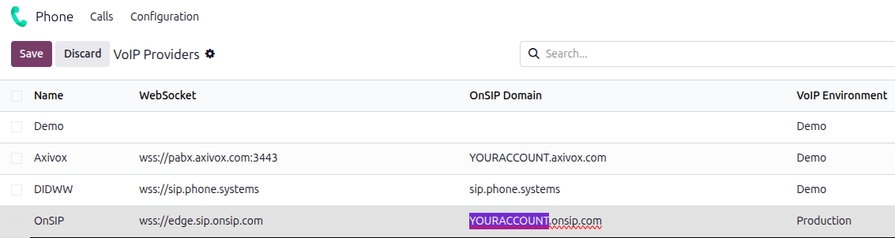
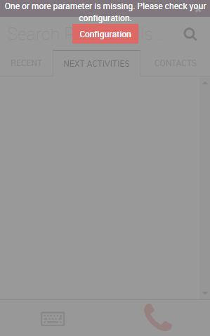
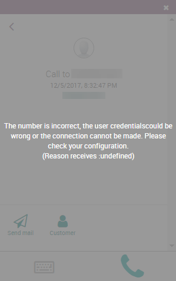

.. |VOIP| replace:: :abbr:`VoIP (Voice over Internet Protocol)`

=====================
Odoo Phone with OnSIP
=====================

`OnSIP <https://info.onsip.com/odoo/>`__ is a |VoIP| provider that can be set up to work with *Odoo
Phone*. An OnSIP account is required to use this service.

.. important::
   Before setting up an account with OnSIP, verify the following requirements:

   - The business phone numbers are portable to OnSIP. Some providers may be unable to release the
     phone number due to local or regional guidelines.
   - The locations of the company and its call recipients are covered by OnSIP services.

   OnSIP |VOIP| services are available in the United States (US) only. A :abbr:`US (United States)`
   billing address and :abbr:`US (United States)` credit card are required to use the service.
   Pricing may vary in Alaska or Hawaii.

Configure OnSIP in Odoo
=======================

To configure OnSIP services in the Odoo database, first :ref:`install <general/install>` the *Phone*
app.

.. _productivity/voip/view-onsip-credentials:

View credentials in OnSIP
-------------------------

To view the necessary OnSIP credentials, navigate to `OnSIP <https://www.onsip.com/>`__ and log in,
then click the :guilabel:`Administrators` link in the top-right corner of the page.

Next, in the menu on the left-hand side, click :guilabel:`Users` and select the user to be
configured. The :guilabel:`USER INFO` tab opens to the right.

<<<<<<< 0eabd3ef44c613404d3f07a6afca9278d7bde711
To configure the Odoo database to connect to OnSIP services, first navigate to the
:menuselection:`Apps application` from the main Odoo dashboard. Then, search for `phone`.
||||||| 8f2246dbaa13e759eaa12afd631a93489cf304da
To configure the Odoo database to connect to OnSIP services, first navigate to the
:menuselection:`Apps application` from the main Odoo dashboard. Then, remove the default `Apps`
filter from the :guilabel:`Search...` bar, and search for `OnSIP`.
=======
Click on the :guilabel:`Phone Settings` tab to view OnSIP configuration credentials.
>>>>>>> 4b7dd9602e58243dded80e6e2d35bc0063f85337

<<<<<<< 0eabd3ef44c613404d3f07a6afca9278d7bde711
Next, activate the :guilabel:`Phone` module.

.. image:: onsip/install-voip.png
||||||| 8f2246dbaa13e759eaa12afd631a93489cf304da
Next, activate the :guilabel:`VOIP OnSIP` module.

.. image:: onsip/install-onsip.png
=======
.. image:: onsip/domain-setting.png
>>>>>>> 4b7dd9602e58243dded80e6e2d35bc0063f85337
   :align: center
<<<<<<< 0eabd3ef44c613404d3f07a6afca9278d7bde711
   :alt: View of Odoo Phone in the app search results.
||||||| 8f2246dbaa13e759eaa12afd631a93489cf304da
   :alt: View of OnSIP app in the app search results.
=======
   :alt: Domain setting revealed (highlighted) on administrative panel of OnSIP management
         console.
>>>>>>> 4b7dd9602e58243dded80e6e2d35bc0063f85337

Add OnSIP credentials
---------------------

<<<<<<< 0eabd3ef44c613404d3f07a6afca9278d7bde711
After installing the *Phone* module, go to the :menuselection:`Phone app`, click on
:guilabel:`Configuration` in the top bar menu, then on :guilabel:`Providers` fields. Then, create
a new entry for OnSIP if it doesn't exist yet and fill the fields with the following information:
||||||| 8f2246dbaa13e759eaa12afd631a93489cf304da
After installing the *VOIP OnSIP* module, go to the :menuselection:`Settings app`, scroll down to
the :guilabel:`Integrations` section, and locate the :guilabel:`VoIP` fields. Then, proceed to fill
in those three fields with the following information:
=======
After :ref:`installing <general/install>` the *Phone - OnSIP* module, go to the
:menuselection:`Phone app --> Configuration --> Providers`. Locate the *OnSIP* provider entry, and
enter the following information:
>>>>>>> 4b7dd9602e58243dded80e6e2d35bc0063f85337

<<<<<<< 0eabd3ef44c613404d3f07a6afca9278d7bde711
- :guilabel:`PBX Server IP`: the domain that was assigned when creating an account on `OnSIP
  <https://www.onsip.com/>`_.
- :guilabel:`WebSocket`: `wss://edge.sip.onsip.com`
- :guilabel:`VoIP Environment`: :guilabel:`Production`
||||||| 8f2246dbaa13e759eaa12afd631a93489cf304da
- :guilabel:`OnSIP Domain`: the domain that was assigned when creating an account on `OnSIP
  <https://www.onsip.com/>`_.
- :guilabel:`WebSocket`: `wss://edge.sip.onsip.com`
- :guilabel:`VoIP Environment`: :guilabel:`Production`
=======
- :guilabel:`OnSIP Domain`: the domain that was assigned when creating an account on `OnSIP
  <https://www.onsip.com/>`__. Replace `YOURACCOUNT` with the company account name.
- :guilabel:`VoIP Environment`: select :guilabel:`Production`.
>>>>>>> 4b7dd9602e58243dded80e6e2d35bc0063f85337

<<<<<<< 0eabd3ef44c613404d3f07a6afca9278d7bde711
You can configure the other fields according to your own preferences.

.. image:: onsip/voip-setting.png
   :align: center
   :alt: Provider configuration in Odoo Phone.
||||||| 8f2246dbaa13e759eaa12afd631a93489cf304da
.. image:: onsip/voip-setting.png
   :align: center
   :alt: VoIP configuration settings in Odoo Settings app.
=======

>>>>>>> 4b7dd9602e58243dded80e6e2d35bc0063f85337

Configure user settings
-----------------------

Next, each user's OnSIP credentials must be configured in Odoo. Navigate to :menuselection:`Settings
app --> Users & Companies --> Users` select the user, and click the *VoIP* tab.

Add the following :ref:`OnSIP credentials <productivity/voip/view-onsip-credentials>` for the user:

- :guilabel:`Provider`: select :guilabel:`OnSIP`.
- :guilabel:`Username`: the user's :guilabel:`OnSIP username`.
- :guilabel:`OnSIP Auth Username`: the user's :guilabel:`Auth Username`.
- :guilabel:`Secret`: the user's :guilabel:`SIP Password`.

<<<<<<< 0eabd3ef44c613404d3f07a6afca9278d7bde711
   To enable compatibility with Odoo Phone, make sure that you set the `Auth username` field to the
   same value as the `Username` field.

Odoo user setting
-----------------

Next, the user needs to be set up in Odoo. Every user associated with an OnSIP user **must** also be
configured in the Odoo user's settings/preferences.

To do that, navigate to :menuselection:`Settings app --> Manage Users --> Select the User`.

On the user form, click :guilabel:`Edit` to configure the user's OnSIP account. Then, click the
:guilabel:`Preferences` tab, and scroll to the :guilabel:`VoIP` section.

In this section, select the provider you just configured and fill in the fields with OnSIP
credentials.

Fill in the following fields with the associated credentials listed below:

- :guilabel:`Username` = OnSIP :guilabel:`Username`
- :guilabel:`Secret` = OnSIP :guilabel:`SIP Password`

.. tip::
   The OnSIP extension can be found in the *User* banner line above the tabs.

When these steps are complete, navigate away from the user form in Odoo to save the configurations.

Once saved, Odoo users can make phone calls by clicking the :guilabel:`☎️ (phone)` icon in the
top-right corner of Odoo.
||||||| 8f2246dbaa13e759eaa12afd631a93489cf304da
Odoo user setting
-----------------

Next, the user needs to be set up in Odoo. Every user associated with an OnSIP user **must** also be
configured in the Odoo user's settings/preferences.

To do that, navigate to :menuselection:`Settings app --> Manage Users --> Select the User`.

On the user form, click :guilabel:`Edit` to configure the user's OnSIP account. Then, click the
:guilabel:`Preferences` tab, and scroll to the :guilabel:`VoIP Configuration` section.

In this section, fill in the fields with OnSIP credentials.

Fill in the following fields with the associated credentials listed below:

- :guilabel:`Voip Username` = OnSIP :guilabel:`Username`
- :guilabel:`OnSIP Auth Username` = OnSIP :guilabel:`Auth Username`
- :guilabel:`VoIP Secret` = OnSIP :guilabel:`SIP Password`

.. tip::
   The OnSIP extension can be found in the *User* banner line above the tabs.

When these steps are complete, navigate away from the user form in Odoo to save the configurations.

Once saved, Odoo users can make phone calls by clicking the :guilabel:`☎️ (phone)` icon in the
top-right corner of Odoo.
=======
Once the OnSIP credentials have been saved, the user can make calls with Odoo **Phone** by clicking
the :icon:`oi-voip` :guilabel:`(Phone)` icon in the top-right corner of Odoo.
>>>>>>> 4b7dd9602e58243dded80e6e2d35bc0063f85337

.. seealso::
   For additional setup and troubleshooting steps, see `OnSIP's knowledge base
   <https://support.onsip.com/hc/en-us>`__.

Handle incoming calls
=====================

Incoming calls appear in the :doc:`*Phone* widget <voip_widget>`. Click the green :guilabel:`📞
(phone)` icon to answer the call, or click the red :guilabel:`📞 (phone)` icon to ignore the call.

.. image:: onsip/incoming-call.png
   :align: center
   :alt: Incoming call in the Odoo **Phone** widget.

Troubleshooting
===============

Missing parameters
------------------

If a *Missing Parameters* message appears in the Odoo **Phone** widget, refresh the browser and try
again.

<<<<<<< 0eabd3ef44c613404d3f07a6afca9278d7bde711
   :align: center
   :alt: Missing parameter message in the Odoo Phone widget.
||||||| 8f2246dbaa13e759eaa12afd631a93489cf304da
   :align: center
   :alt: Missing parameter message in the Odoo VoIP widget.
=======
   :alt: Missing parameter message in the *Odoo Phone* widget.
>>>>>>> 4b7dd9602e58243dded80e6e2d35bc0063f85337

Incorrect number
----------------

If an *Incorrect Number* message appears in the Odoo **Phone** widget, make sure to include the
phone number's international country code. For example: in the phone number `16505555555`, `1` is
the international country code for the United States.

<<<<<<< 0eabd3ef44c613404d3f07a6afca9278d7bde711
   :align: center
   :alt: Incorrect number message populated in the Odoo Phone widget.
||||||| 8f2246dbaa13e759eaa12afd631a93489cf304da
   :align: center
   :alt: Incorrect number message populated in the Odoo VoIP widget.
=======
   :alt: Incorrect number message in the Odoo **Phone** widget.
>>>>>>> 4b7dd9602e58243dded80e6e2d35bc0063f85337

.. seealso::
   For a list of comprehensive country codes, visit: `https://countrycode.org
   <https://countrycode.org>`_.

OnSIP smartphone app
====================

<<<<<<< 0eabd3ef44c613404d3f07a6afca9278d7bde711
In order to make and receive phone calls when the user is not in front of Odoo on their computer, a
softphone app on a mobile phone can be used in parallel with Odoo *Phone*.

This is useful for convenient, on-the-go calls, and to make sure incoming calls are heard. Any SIP
softphone will work.
||||||| 8f2246dbaa13e759eaa12afd631a93489cf304da
In order to make and receive phone calls when the user is not in front of Odoo on their computer, a
softphone app on a mobile phone can be used in parallel with Odoo *VoIP*.

This is useful for convenient, on-the-go calls, and to make sure incoming calls are heard. Any SIP
softphone will work.
=======
To make and receive phone calls outside of Odoo, users can use any SIP softphone app in parallel
with Odoo **Phone**. The OnSIP softphone app is available on Windows, macOS, Linux, iOS, and
Android.
>>>>>>> 4b7dd9602e58243dded80e6e2d35bc0063f85337

.. seealso::
   - :doc:`devices_integrations`
   - `OnSIP app download <https://www.onsip.com/app/download>`_
