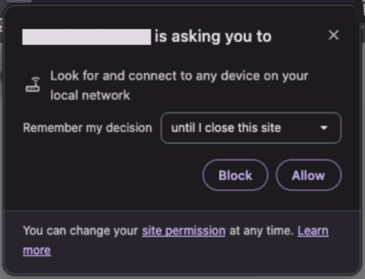
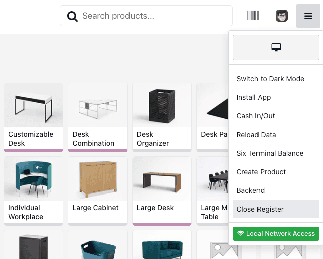

====================
Local Network Access
====================

.. warning::
   When using ePOS printer, a static IP address is absolutely necessary for the printer.
   Without it, the printer may become unreachable.

   The IP address must be set from the router.
.. _pos_lna:

Since the Chromium 142 update, a new feature called “Local Network Access” has been introduced.
It is now possible to grant local network access to a specific web page.

This allows us to contact printers directly from the browser without IoT.

Activate Local Network Access
=============================

Add a new **key** in the **System Parameters** to force your Point of Sale to use local network access
over a secure connection.

To do so, activate the :ref:`developer mode <developer-mode>`, go to :menuselection:`Settings -->
Technical --> Parameters --> System Parameters`, then create a new parameter, add the following
values and click on *Save*.

- **Key**: `point_of_sale.use_lna`
- **Value**: `True`

Supported Browsers
==================

Most browsers based on Chromium version 142 or higher are compatible.

- Google Chrome Browser
- Brave Browser
- Microsoft Edge Browser
- Vivaldi
- Opera

Sometimes you need to enable a flag in the browser to activate the feature.

- `brave://flags/#local-network-access-check`
- `chrome://flags/#local-network-access-check`

Browser Permission
==================

When you use your browser and after configuring a printer with local network access,
a pop-up window will appear asking for permission.

Once accepted, the browser will be able to contact devices on your local network.

.. note::
   If the popup does not appear, you can add the permission manually via the site settings.
   For more information, visit `Google <https://support.google.com/chrome/answer/114662>`_.

Point of Sale Status
====================

When you open the burger menu in the top right corner, there is a new button.
Clicking on it provides information about activating Local Network Access.

.. seealso::
   - :doc:`epos_printers`
